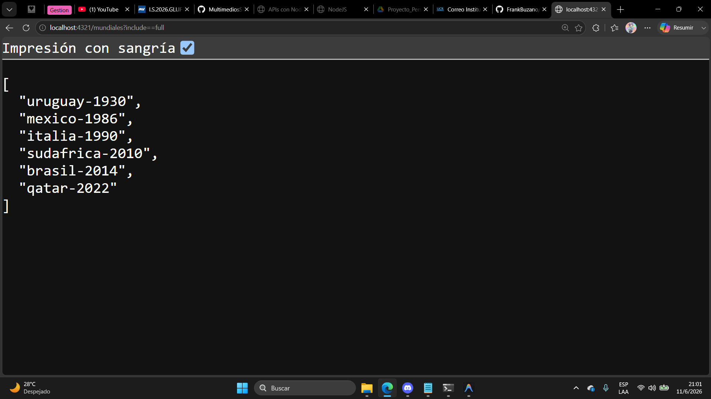
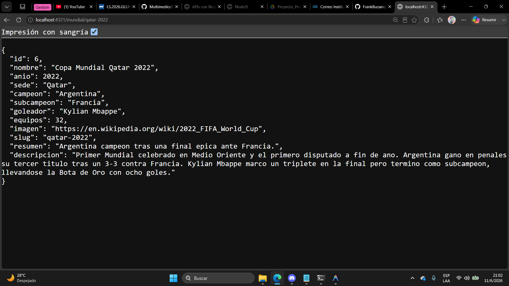
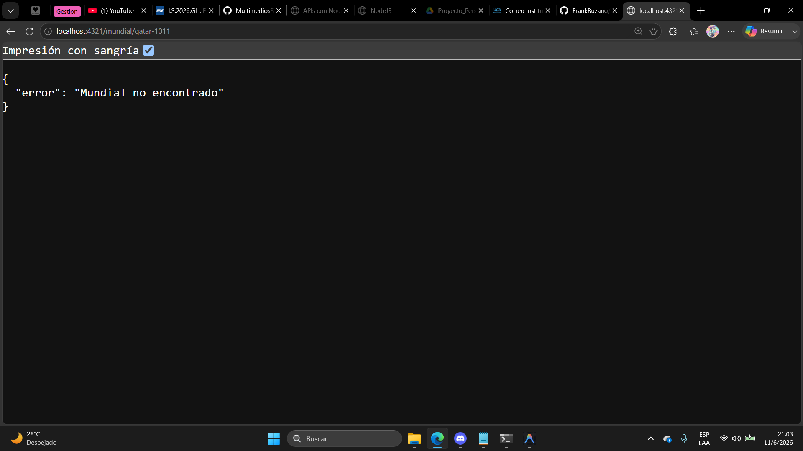
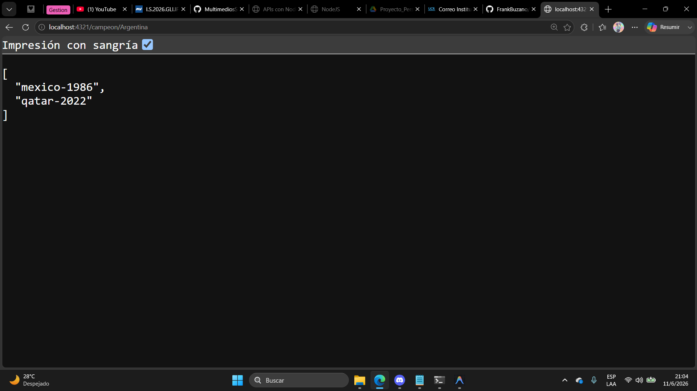
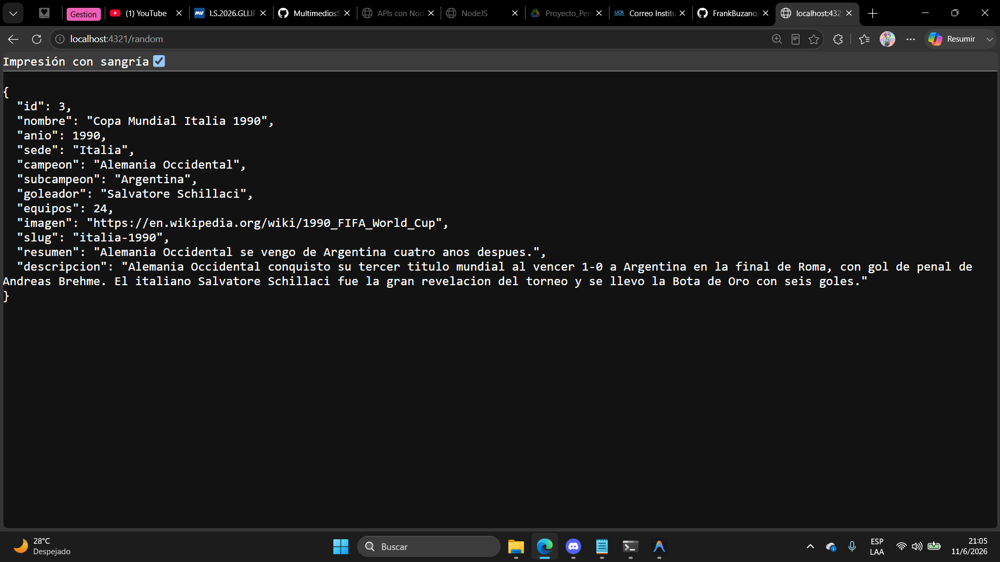
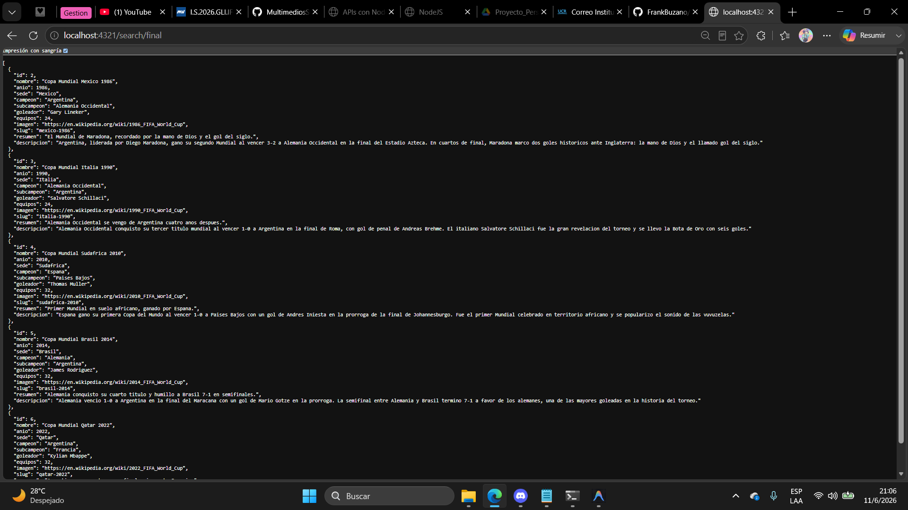
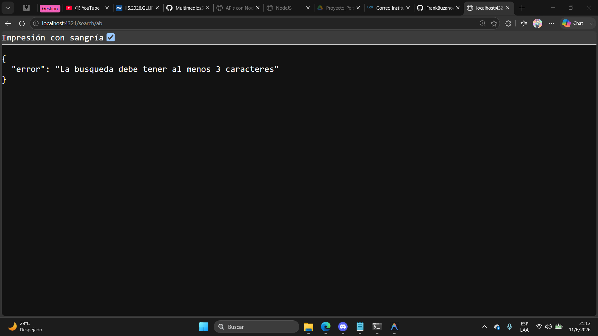

# API Copa Mundial FIFA

API REST construida con **Node.js + Express + SQLite** que expone informacion historica de las ediciones de la Copa Mundial de la FIFA. Permite listar ediciones, consultarlas por slug, filtrar por pais campeon, obtener una al azar, buscar por texto y obtener la imagen asociada a cada mundial.

Proyecto desarrollado como Tarea 2 del curso de Multimedios.

## Requisitos

- **Node.js 22+** (este proyecto usa el modulo nativo `node:sqlite`).
- **pnpm 10+**

## Instalacion

1. Clonar el repositorio:

   ```bash
   git clone <url-del-repo>
   cd tarea2_multimedios
   ```

2. Instalar dependencias:

   ```bash
   pnpm install
   ```

## Poblar la base de datos

La base de datos es un archivo SQLite (`data/mundiales.db`) que se genera localmente a partir de un script de seed.

```bash
pnpm db:create
```

Esto ejecuta `data/createdb.js`, que:

1. Lee el script `data/CREATE.SQL` para crear (o re-crear) la tabla `mundiales`.
2. Inserta los registros definidos en `data/data.json` (6 ediciones del Mundial).

## Ejecutar el servidor

Modo desarrollo:

```bash
pnpm dev
```

Modo produccion:

```bash
pnpm start
```

El servidor queda escuchando en:

```
http://localhost:4321/
```

## Endpoints

| Metodo | Ruta | Descripcion |
|---|---|---|
| `GET` | `/` | Informacion del API y lista de endpoints |
| `GET` | `/mundiales` | Lista de slugs de todas las ediciones |
| `GET` | `/mundiales?include=full` | Lista completa con todos los campos |
| `GET` | `/mundial/:slug` | Detalle de una edicion por slug |
| `GET` | `/campeon/:pais` | Slugs de las ediciones ganadas por un pais (case-insensitive) |
| `GET` | `/random` | Una edicion elegida al azar |
| `GET` | `/search/:text` | Busqueda por texto en nombre, sede, campeon, subcampeon, goleador, resumen y descripcion |
| `GET` | `/imagenes/:slug` | Redirect 302 a la URL externa de la imagen del mundial |

### Codigos de estado

| Codigo | Cuando ocurre |
|---|---|
| `200 OK` | La peticion fue exitosa y se devuelven datos |
| `302 Found` | Redirect (solo en `/imagenes/*`) |
| `400 Bad Request` | La validacion de entrada con Zod fallo (ej. busqueda muy corta) |
| `404 Not Found` | El recurso solicitado no existe o la ruta no esta definida |

### Ejemplos de uso

```bash
# Listar slugs
curl http://localhost:4321/mundiales

# Detalle de una edicion
curl http://localhost:4321/mundial/qatar-2022

# Mundiales ganados por Argentina
curl http://localhost:4321/campeon/argentina

# Edicion aleatoria
curl http://localhost:4321/random

# Busqueda
curl http://localhost:4321/search/maradona

# Imagen (devuelve 302 a la URL externa)
curl -I http://localhost:4321/imagenes/qatar-2022
```














